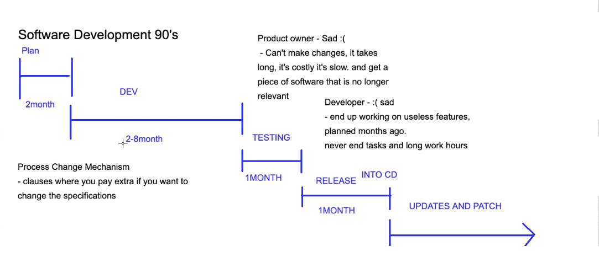
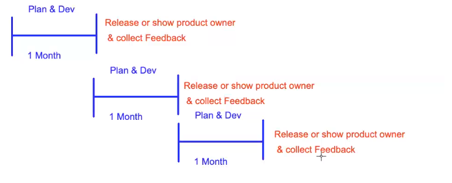
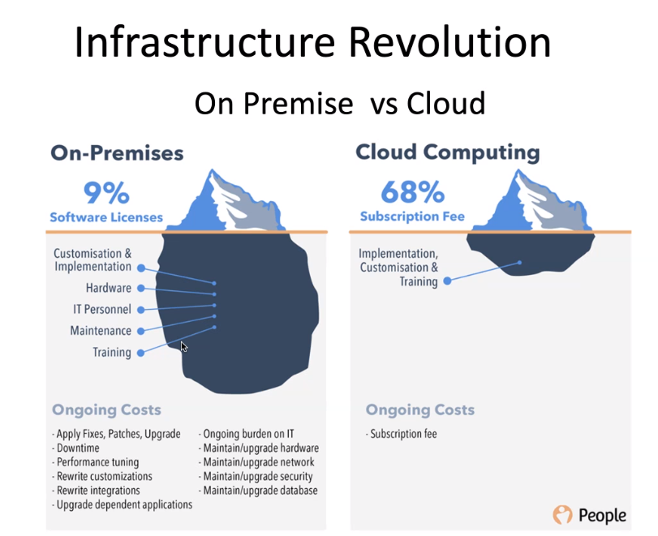
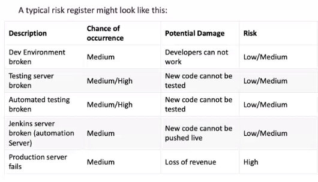

# Intro to DevOps

#### Software development in the 90's

#### Software develoment in 2000-2010
- Deliver value a lot earlier and connect feedback sooner
- Made product owners
- Developer
- Makes clients
- Agile everywher
- Cloud becaomes a thing

### DevOps coming into play
- CI/CD  pipelines
- Continuous testing
- Standardized environments
- Keeping cost low and handleing peaks of growth
- Companies with strong DevOps culture strongly out perform their competitors

#### Infrastructure Revolution

#### Risk register

## Dev Environments
- Bypasses the problem of "Well it works on my machine"by standardizing the environments
-  Lots of different environments, dev, testing, production

- To the best of its ability it should mirror the testing and production environement

